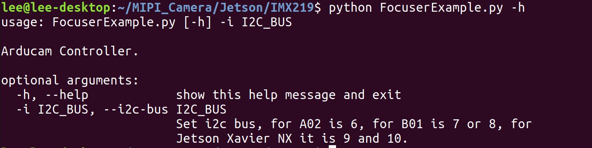

# Description
This is the example how to use ArduCam IMX219 AF Module on Jetson Nano 

# Usage
* Autofocus.py Example of autofocus  
    python Autofocus.py -i 7  

    help:  
      
    
    Tip: The I2C bus of the CAM0 interface of Jetson Nano B01 is 7, and the I2C bus of the CAM1 interface is 8.  
    The I2C bus of the CAM0 interface of Jetson Xavier NX is 10, and the I2C bus of the CAM1 interface is 9.

* FocuserExample.py Example of manual focus  
    python FocuserExample.py -i 7  

    help:  
      

    example:  
      

    Screenshot:  
      