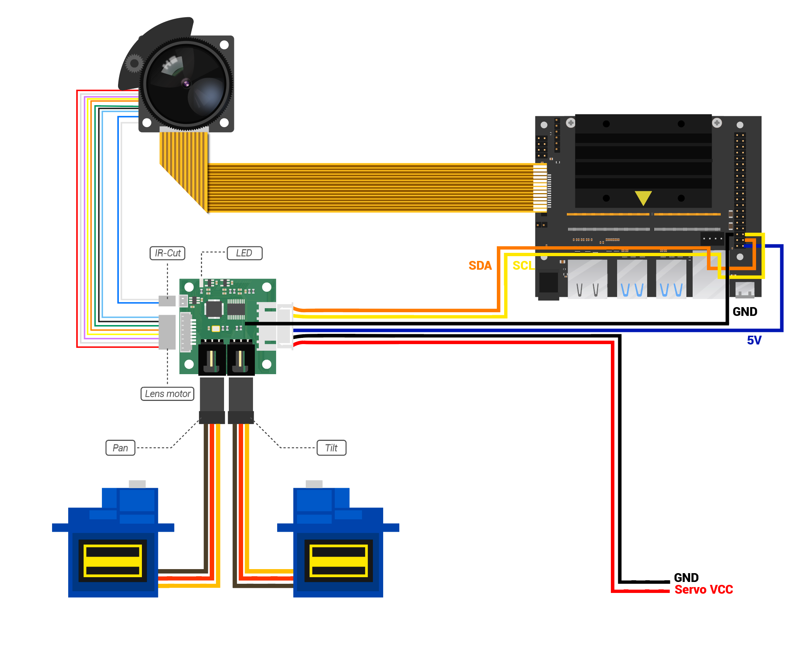

## Hardware Connection


## Usage  
1. Download source code
    ```
    git clone https://www.github.com/arducam/MIPI_Camera.git
    ```
2. Installation dependencies
    ```
    sudo apt install python-smbus
    ```
3. Enter the source directory
    ```
    cd MIPI_Camera/Jetson/JetsonNano_PTZ/
    ```
4. Run the example script
    ```
    python FocuserExample.py
    ```
## Focuser.py
* zoom-lens basic control component.

## AutoFocus.py
* Provide two autofocus methods are available, depending on Focuser.py, opencv
* Use the `sudo apt-get install python-smbus` command to install smbus.

## AutoFocusExample.py
* Example of using autofocus, depending on AutoFocus.py

## FocuserExample.py
* zoom-lens controller.
```bash 
lee@lee-desktop:~/MIPI_Camera/Jetson/JetsonNano_PTZ$ python FocuserExample.py
```


