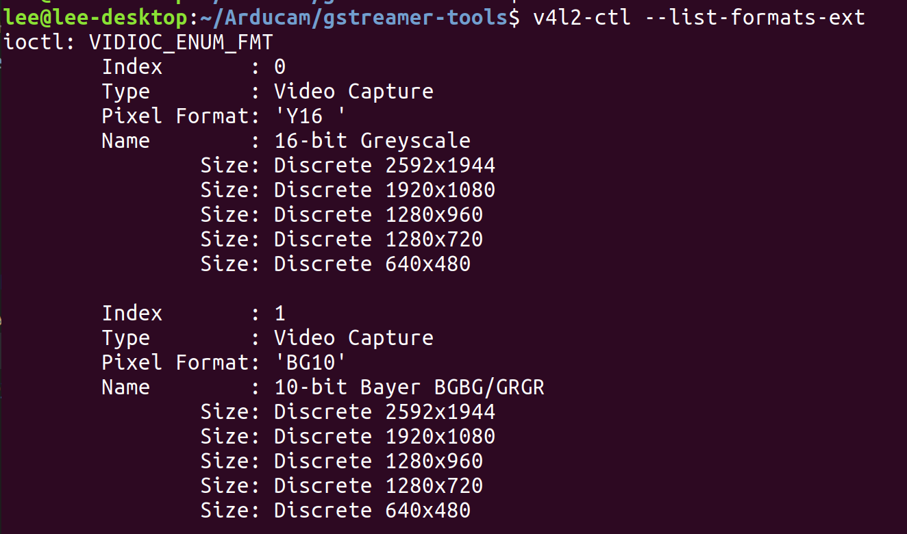

## Introduction
Most of Arducam's cameras only support the RAW format, and Gstreamer does not support this format. For this reason, we provide a simple tool that uses OpenCV to take pictures and convert them to I420 and then output to stdout.

## Dependent installation  
Follow this document to install python3 dependencies:  
https://www.arducam.com/docs/camera-for-jetson-nano/mipi-camera-modules-for-jetson-nano/camera-demonstration/#5-31-install-v4l2-python-module

## arducam_tostdout.py steps

1. Check the resolution supported by the camera  
run command `v4l2 --list-formats-ext` :  


2. Fill in the relevant parameters of the server pipline  
    ```
    python3 arducam_tostdout.py  --width <width> --height <height> | gst-launch-1.0 -v fdsrc blocksize=<width>*<height>*1.5 ! 'video/x-raw, format=(string)I420, width=(int)<width>, height=(int)<height>, framerate=(fraction)80/1' ! nvvidconv ! 'video/x-raw(memory:NVMM), format=(string)I420' ! omxh264enc profile=high cabac-entropy-coding=true insert-sps-pps=true iframeinterval=60 ! 'video/x-h264, level=(string)4.2, stream-format=(string)byte-stream' ! tcpserversink host=localhost port=5001
    ```
    Take 2592x1944 as an example:
    ```
    python3 arducam_tostdout.py  --width 2592 --height 1944 | gst-launch-1.0 -v fdsrc blocksize=7558272 ! 'video/x-raw, format=(string)I420, width=(int)2592, height=(int)1944, framerate=(fraction)80/1' ! nvvidconv ! 'video/x-raw(memory:NVMM), format=(string)I420' ! omxh264enc profile=high cabac-entropy-coding=true insert-sps-pps=true iframeinterval=60 ! 'video/x-h264, level=(string)4.2, stream-format=(string)byte-stream' ! tcpserversink host=localhost port=5001
    ```

3. Client pipeline
    ```
    gst-launch-1.0 -v tcpclientsrc port=5001 ! decodebin ! autovideosink
    ```
