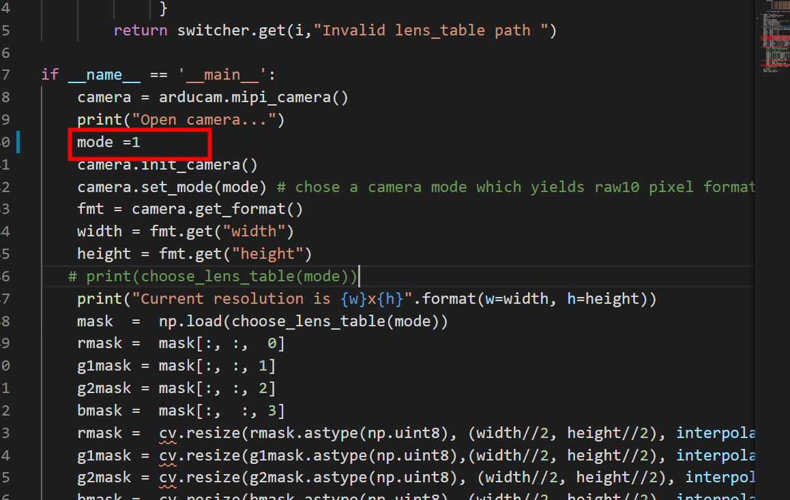
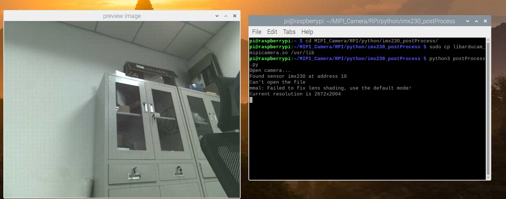

-  This demo is used for arducam imx230 sensor.The function of the demo is used to fix imx230 lens shading problems.

## Quickly start
    - Step1: 
```Bash
    cd MIPI_Camera/RPI/python/imx230_postProcess
```
- Step 2: Install the libarducam_mipicamera.so
```Bash
    sudo cp libarducam_mipicamera.so /usr/lib
```
- Step 3: Change resolution if not, use the default


- Step 4: Run the postProcess.py
```Bash
    python3 postProcess.py
```
  

  
